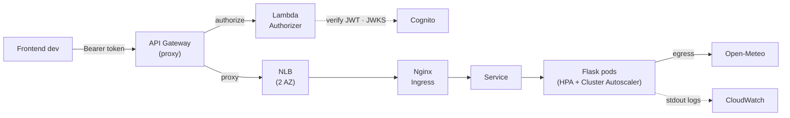

# Max Weather — DevOps Assessment

Production-ready weather-forecast platform on AWS: highly available, autoscaling, OAuth2-protected APIs, Jenkins CI/CD, and centralized logging — provisioned with modular Terraform on remote state, with a keyless (OIDC) infra pipeline. Solution to the 101 Digital DevOps Technical Assessment.

**→ Requirement & deliverable traceability (what, where, evidence): [docs/traceability.md](docs/traceability.md)**

## Architecture

**HA:** VPC + nodes across 2 AZ · **Scale:** HPA (pods) + Cluster Autoscaler (nodes) · **Logs:** Fluent Bit → CloudWatch.

Full diagram + control/data-plane walkthrough: [docs/architecture.md](docs/architecture.md). One-page overview: [docs/overview.html](docs/overview.html).

## Repo map
| Path | Contents |
|---|---|
| [app/](app/) | Flask weather proxy + Dockerfile |
| [terraform/](terraform/) | Root + `modules/{vpc,ecr,eks,cognito,lambda-authorizer,api-gateway,cloudwatch}`; `bootstrap/` (S3 state + DynamoDB lock + GitHub OIDC role); `backend.tf` |
| [k8s/](k8s/) | Kustomize `base/` (Deployment, Service, Nginx Ingress, HPA) + `overlays/{staging,prod}` + `platform/` (ingress-nginx, metrics-server, cluster-autoscaler) |
| [jenkins/](jenkins/) | `Jenkinsfile` (build→ECR→staging→approval→prod), tool-equipped host image with a JCasC-seeded job, `RUNBOOK.md`, `Jenkinsfile.infra` |
| [.github/workflows/](.github/workflows/) | Terraform CI — authenticates to AWS via GitHub **OIDC** (no static keys) |
| [postman/](postman/) | API collection with the OAuth2 auth flow |
| [Makefile](Makefile) | One-command provisioning: `make up` / `verify` / `destroy` |
| [docs/](docs/) | traceability · architecture · configuration · naming-and-tagging · evidence · overview.html · [adr/](docs/adr/) |

## Deliverables
All six are done and proven live — see the traceability matrix for how each maps to code + evidence: **[docs/traceability.md](docs/traceability.md)**.

## Getting started
```sh
make up                 # provision: infra → platform → wire API Gateway (Terraform on S3 state)
# deploy the app through Jenkins — see jenkins/RUNBOOK.md
make verify             # exercise the API with OAuth2 (Postman/newman)
make destroy            # tear down
```
State is remote and locked (S3 encrypted + DynamoDB); the Terraform CI pipeline assumes an AWS role via GitHub OIDC — no static credentials. Conventions & guardrails: [CLAUDE.md](CLAUDE.md). Decisions: [docs/adr/](docs/adr/).

## AI-assisted development
This solution is **AI-assisted by design, and I want that to be visible.** I did not hand-write the code — I **directed** it: I own the architecture, the conventions, and the workflow, and I drive Claude Code (agentic coding) to implement exactly that, reviewing and correcting every step against the standards I set. The engineering value here is in **governing the system and the process**, not in typing.

The discipline that makes that trustworthy is in the repo itself:
- [CLAUDE.md](CLAUDE.md) — the conventions and guardrails the agent must follow (naming, tagging, module anatomy, plan-before-apply)
- [docs/adr/](docs/adr/) — every significant decision and its rationale (and what was deliberately deferred)
- One Conventional Commit per phase — the git log reads as the process
- `terraform-docs`-generated module docs, and live [evidence](docs/evidence.md)

Rationale: [docs/adr/0001-ai-assisted-workflow.md](docs/adr/0001-ai-assisted-workflow.md).
