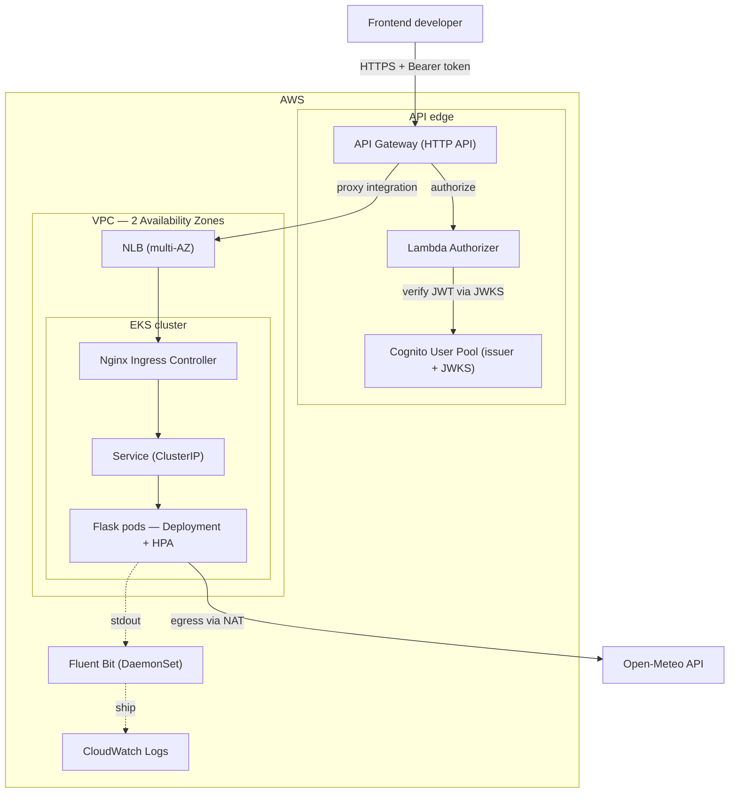

# Architecture — Max Weather

Max Weather is a weather-forecast platform on AWS. Frontend developers call a small set of HTTP APIs; those APIs are protected by OAuth2, served by a stateless application on Kubernetes (EKS), and fronted by AWS API Gateway. The design targets four pillars from the brief: **high availability**, **autoscaling with traffic**, **OAuth2-protected APIs**, and **operability** (centralized logs, IaC, CI/CD).

## Request flow (data plane)

Every hop on this path is on the request's critical path — if a hop is down, the request is affected. Why each hop exists:

| Hop | Why it exists |
|---|---|
| API Gateway | Managed API front door: hosts the OAuth2 authorizer, throttling, a stable endpoint. Keeps "API management" separate from "cluster ingress". |
| Lambda Authorizer | Called by API Gateway before the request reaches the backend; returns allow/deny. Keeps auth out of the application entirely — the backend never sees unauthenticated traffic. |
| Cognito | OAuth2 token issuer. The authorizer validates the JWT locally against Cognito's public keys (JWKS): signature, issuer, audience, expiry — no per-request call to Cognito. |
| API Gateway → NLB (proxy) | The brief allows proxy integration, so API Gateway forwards the request to the cluster entrypoint. A Service of type LoadBalancer on EKS provisions the NLB. |
| Nginx Ingress Controller | L7 routing inside the cluster (host/path → Service). The **Controller** is the running pods executing the rules; the **Ingress resource** is the rule config. |
| Service | Stable virtual IP + DNS in front of ephemeral pods, load-balancing across the pods that match its selector. Lets the Ingress target a fixed name while pods come and go. |
| Pods (Flask) | The stateless workload. Any pod serves any request, which is what makes horizontal scaling and self-healing work. |
| Open-Meteo | Upstream weather provider. Pods egress via NAT from private subnets — outbound only, never directly reachable from the internet. |

## Control plane vs data plane

- **Data plane** — the path above that carries user traffic. SRE concern: latency, error rate, multi-AZ spread. Failures here are user-visible immediately.
- **Control plane** — components that manage and decide but do not sit on the request path:
  - **EKS control plane** (API server, scheduler, etcd) — holds desired state, schedules pods.
  - **HPA** — decides pod count from metrics (CPU/traffic).
  - **Cluster Autoscaler** — decides node count when pods cannot be scheduled.
  - **Nginx Ingress Controller** (watch loop) — reads Ingress resources and configures its own nginx data plane; nginx bridges both planes.
  - **Cognito** — identity management (issuing tokens).
  - **Jenkins + Terraform** — build and provision both planes.

Key property: if the **control plane** degrades, the **data plane keeps serving** — running pods still answer requests; what is lost is the ability to *change* (scale, self-heal, deploy). If the **data plane** fails, users see it at once. This separation drives incident triage: "hard down" (data plane) vs "degraded, drifting" (control plane).

## High availability & failure modes

HA building blocks: VPC across **2 AZs** (public + private subnets per AZ), managed node group across 2 AZs, multi-AZ NLB, Deployment with **≥ 2 replicas spread across AZs**, AWS-managed HA control plane. Principle: nothing on the critical path has a single instance.

| Failure | Control plane response | User impact |
|---|---|---|
| One pod (crash / liveness fail) | kubelet restarts it; ReplicaSet keeps replica count | None — Service routes to remaining pods |
| One node | scheduler reschedules pods to healthy nodes; Cluster Autoscaler adds a node if capacity is short | Brief if pods are already spread; none with replicas elsewhere |
| One full AZ | NLB stops routing to the dead AZ and shifts to the survivor; scheduler + CA rebuild pods in the healthy AZ | Short blip, then steady — this is why 2 AZs are required |
| Traffic spike (morning peak) | HPA adds pods on CPU; if pods can't fit, CA adds nodes (two-tier scaling) | None — scales out in time; scales back down after peak |
| Open-Meteo slow/down | none — app times out (5s) and returns 502, pod stays healthy | Degraded (no forecast), but the platform stays up; no cascading restarts |
| EKS control plane degraded | AWS-managed HA recovers it | Running pods keep serving; scaling/deploy/self-heal paused until recovery |
| Lambda authorizer / Cognito error | API Gateway fails **closed** — rejects the request | Requests denied — a deliberate "secure over available" choice at the auth layer |

## Autoscaling

Two tiers, both required by "scalable based on traffic":
- **HPA** scales *pods* within existing node capacity, from CPU/traffic metrics.
- **Cluster Autoscaler** scales *nodes* when pods cannot be scheduled.

With only HPA, pods go `Pending` once nodes are full; with only CA, nodes grow but pod count does not follow traffic. Both together give elastic scale, then scale back down to control cost.

Autoscaling is **core here, not an add-on**, because the load is spiky and predictable — people check the forecast in the morning. Fixed capacity would force a bad trade: size for the peak and pay for idle capacity most of the day, or size for the average and fall over at peak. Autoscaling is the only way to stay available at peak *and* avoid paying for idle capacity off-peak — scaling out protects availability, scaling in controls cost, and both happen without manual intervention. Because the spike is CPU-driven and predictable, reactive HPA on CPU is sufficient; no predictive or scheduled scaling is needed.

## Observability

Application writes one structured JSON line per event to **stdout**. A **Fluent Bit DaemonSet** on each node tails container stdout and ships it to **CloudWatch Logs**. The app holds no AWS credentials and no CloudWatch SDK — log transport is the platform's responsibility, which keeps the app portable across clouds.

## Security & auth

OAuth2 via Cognito (`client_credentials`) as issuer and a custom Lambda authorizer validating the JWT at the gateway. The workload runs in private subnets (egress via NAT), inbound only through the NLB/Ingress. See [ADR-0003](adr/0003-oauth2-cognito-lambda-authorizer.md).

## Related decisions
- [ADR-0002](adr/0002-use-eks-for-orchestration.md) — EKS as the orchestration platform
- [ADR-0003](adr/0003-oauth2-cognito-lambda-authorizer.md) — OAuth2 via Cognito + Lambda authorizer
- [ADR-0004](adr/0004-single-cluster-two-namespaces.md) — single cluster, staging + prod namespaces
- [ADR-0005](adr/0005-open-meteo-weather-source.md) — Open-Meteo as the weather source
